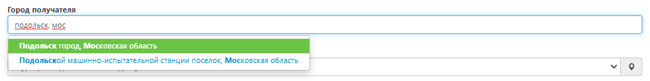
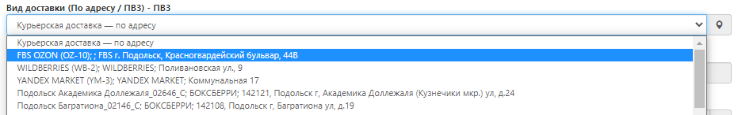
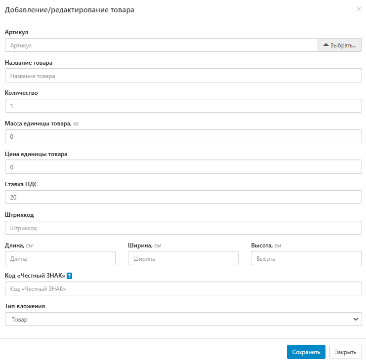
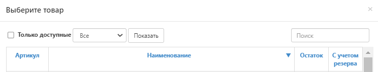

# Оформление доставки до маркетплейсов (FBS)

Схема Fulfillment by Seller (FBS) - продажи со склада поставщика. Доставка до склада (РЦ, СЦ) маркетплейса осуществляется после предварительной обработки и подготовки товаров на складе FuLEx. 

## [Интеграция](integration.md)
FuLEx упрощает задачу Sellers и предлагает интеграционное
решение. Заказы по схеме Fulfillment by Seller (FBS) автоматически будут попадать на склад FuLEx для комплектации и упаковки с целью дальнейшей доставки до
Сортировочных центров Wildberries.  Условия подключения можно уточнить в чате клиентской поддержки.

## Ручное оформление

## Создание заявки
Для создания заявки необходимо перейти во вкладку Оформить заказ далее Новый заказ

**Важно помнить при оформлении заказов:** 1 заказ на маркетплейс = 1 заявка в Личном кабинете FuLEx

## Оформление заявки

### Номер заказа

- Для заказов из Wildberies: FBS_\<*номер заказа из кабинета маркетплейса*\>. Пример: FBS_56843653
- Для заказов Ozon: FBS_O\<*номер заказа из кабинета маркетплейса*\>. Пример: FBS_O005698-4789-4. Обратите внимание, что буква "О" в префиксе также набирается латиницей.
- Для заказов Яндекс.Маркет: FBS_Y\<*номер заказа из кабинета маркетплейса*\>. Пример: FBS_Y56843653
- Для заказов AliExpress: FBS_AL\<*номер заказа из кабинета маркетплейса*\>. Пример: FBS_ALA00568978956
- Для заказов СБЕРМЕГАМАРКЕТ: FBS_S\<*номер заказа из кабинета маркетплейса*\>. Пример: FBS_S2596379655

### Тип отправления
Всегда - FulEx
 
### Город получателя
Всегда - Москва город, при доставке заказа на **WILDBERRIES**

**Ozon** - Подольск, Московская область, рекомендуем выбрать ППЗ (Пункт приема заказов) именно в этом городе, то есть, вблизи склада FuLEx. 
 
**Иной** вариант, в зависимости от населенного пункта, где располагается склад (ППЗ) нужного вам маркетплейса.

### Вид доставки 
Выберите из раскрывающегося списка в поле "Вид доставки", нужный вариант:
-  **WILDBERRIES** - всегда FBS WILDBERRIES:

-  **OZON** - рекомендуем выбрать самый ближайший к нашему складу адрес ППЗ Ozon. 
 

-  **Иной маркетплейс**:

### Данные о получателе
Необходимо указать данные о компании (маркетплейсе), в которую будет доставлен заказ.

- **Адрес и индекс получателя** заполняется автоматически после выбора нужного ПВЗ;
- **Компания** - название маркетплейса;
- **ФИО получателя** - Укажите ФИО человека, с кем можно коммуницировать по вопросу поставки. Это должен быть сотрудник с вашей стороны. 
- **Телефон получателя** - контактный телефон человека, с кем можно коммуницировать по вопросу поставки. Это должен быть сотрудник с вашей стороны. 
- **Дата доставки** - планируемая дата доставки
  - Обратите внимание, что заявки принятые до 18:00 могут доставляться на следующий день.
  - Если Вы оформляете заявку после 18 часов, то она будет доставлена через день.
- **Время доставки с / Время доставки по** - интервал, в который необходимо доставить заказ
  - Доступные интервалы: 9:00 - 12:00; 12:00 - 15:00; 15:00 - 18:00; 18:00 - 20:00. 
  - Минимальные интервалы доставки 3 часа - выберите наиболее подходящий интервал, исходя из временного окна маркетплейса.

### Товары

Необходимо открыть развернутое меню и добавить товар в заказ.

- **Артикул товара** - нажмите “Выбрать“. Открывается список вашей номенклатуры, возможность поиска нужного SKU и иные варианты сортировки. 

 

Выберите нужный артикул товара.

**ВАЖНО:**  позиции с остатком 0 добавить в заказ нельзя. 

- **Количество** - впишите количество единиц выбранного артикула;

Оставшиеся поля заполнятся автоматически, либо правятся вручную, кроме ВГХ (весогабаритных характеристик). 
Особое внимание уделите полям, где требуется указание цены. Заказ на маркетплейс не предполагает оплату, поэтому поставьте везде 0.

Теперь смело нажимайте **"Сохранить".**

**Проверьте**, в заявке отображается нужное количество единиц выбранной позиции. Теперь  выполните те же действия, только для добавления новых позиций.

### Данные о грузе (общие)

* **Вес** - автоматически суммируется, если ранее верно был заполнен раздел "Товары";
* **Сумма наложенного платежа** - заказ на маркетплейс НЕ предполагает оплату, поставьте 0.
* **Сумма страхования груза** из этой цифры будет рассчитана страховка вашего отправления, если вы указали сумму и сохранили заявку, то отменить данное действие или изменить указанную сумму нельзя. Данные автоматически отправляются в страховую компанию. Если вам не нужно страховать груз, то напишите 0.

 

- **Количество грузомест** - заполнится складом по результатам сборки заказа. Самостоятельно не заполняйте.

### Поручение

- **Поручение** - техническое задание, в котором описано что нужно сделать с товаром из заявки, если такие услуги необходимы (если ТЗ обширное, то вложите его в Прикрепленные файлы и сообщите об этом в поле "Поручение"). Перечень услуг склада представлен в Приложении № 1 к Агентскому договору.

### Тип оплаты и необходимость возврата документов 

- **Тип оплаты** - всегда "Без оплаты";
- **Необходимость возврата документов** - Да/Нет. 

### Прикрепленные файлы

- Вложите документы, как правило, развернутое Техническое задание, документы по доставке (Акт приема-передачи, ТТН). 

## Статус выполнения заявки
Отслеживать статус выполнения заявки можно через вкладку "Отслеживание" по ее номеру. 

