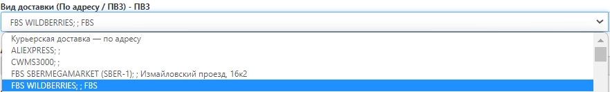

# Оформление доставок до маркетплейсов (FBS)

## Интеграция
Интеграция автоматически передает заказы из личного кабинета маркетплейса в личный кабинет FulEx. Условия подключения можно уточнить в чате клиентской поддержки.

## Ручное оформление
**Важно помнить при оформлении заказов:** 1 заказ на маркетплейс = 1 заявка в Личном кабинете FulEx

### Номер заказа

- Для заказов из Wildberies: FBS_\<номер заказа из кабинета маркетплейса\>. Пример: FBS_56843653
- Для заказов Ozon: FBS_O<номер заказа из кабинета маркетплейса>. Пример: FBS_O005698-4789-4. Обратите внимание, что буква "О" в префиксе также набирается латиницей.
- Для заказов Яндекс.Маркет: FBS_Y<номер заказа из кабинета маркетплейса>. Пример: FBS_Y56843653
- Для заказов AliExpress: FBS_AL<номер заказа из кабинета маркетплейса>. Пример: FBS_ALA00568978956
- Для заказов СБЕРМЕГАМАРКЕТ: FBS_S<номер заказа из кабинета маркетплейса>. Пример: FBS_S2596379655

### Тип отправления
Всегда - FulEx
 
### Город получателя
Всегда - Москва город, при доставке заказа на WILDBERRIES

Иной вариант, в зависимости от населенного пункта, где располагается склад нужного Вам маркетплейса

### Вид доставки
Выберите из раскрывающегося списка в поле "Вид доставки", нужный вариант:
-  WILDBERRIES - всегда FBS WILDBERRIES:

-  Иной маркетплейс:

### Заполните данные о получателе

- ФИО - Укажите ФИО человека, с кем можно коммуницировать по вопросу поставки. Это должен быть сотрудник с вашей стороны. 
- Телефон - контактный телефон (по нему будет осуществляться коммуникация).
- Дата доставки - планируемая дата доставки
  - Обратите внимание, что заявки принятые до 18:00 могут доставляться на следующий день.
  - Если Вы оформляете заявку после 18 часов, то она может быть доставлена не раньше чем через день.
- Время доставки с / Время доставки по - интервал, в который необходимо доставить заказ
  - Доступные интервалы: 9:00 - 12:00; 12:00 - 15:00; 15:00 - 18:00; 18:00 - 20:00. 
  - Минимальные интервалы доставки 3 часа.

### Товары

Необходимо открыть развернутое меню и добавить товар, который  необходимо добавить в заказ.

- Нажмите на кнопку “выбрать“ и в выпадающем меню вы увидите всю номенклатуру, которая была ранее создана, в том числе позиции с остатком 0 (добавить в заявку их нельзя, они отображаются информативно)

  
- Добавьте товарную единицу в заявку, указав нужное количество.

  
- Нажмите кнопку сохранить, таким образом Вы добавили SKU, 

  
- После того как в заявке вы увидите добавленную позицию можно выполнить те же действия, для добавления новых позиций.

### Дополнительная информация

- Описание - краткое описание, что нужно сделать с Вашим товаром.
- Поручение - детальное техническое задание, в котором описано что нужно сделать с вашим товаром.

### Тип оплаты

- Укажите “тип оплаты” - Без оплаты. 

### Данные об отправлении
- Тип доставки - выберите FulEx.

    
- Необходимость возврата документов - укажите “да”, если Вам нужно вернуть оригиналы документов.

### Прикрепленные файлы

- Вложите документы, которые необходимо передать получателю (доверенность, универсальный передаточный документ, товарно-транспортную накладную и тд).
