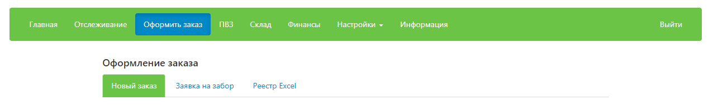
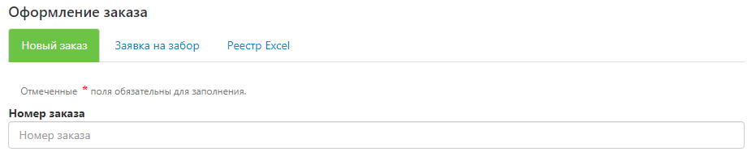
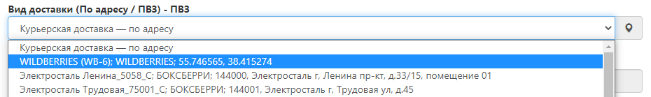
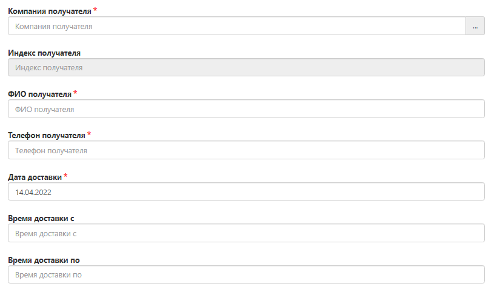
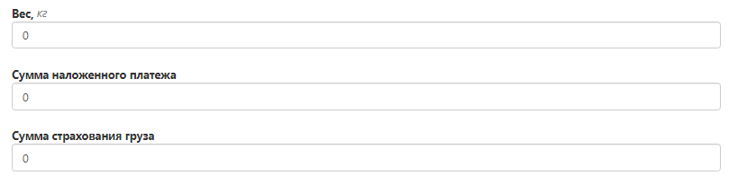
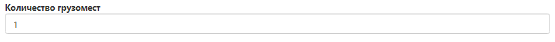
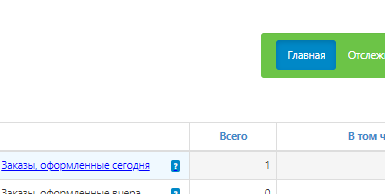
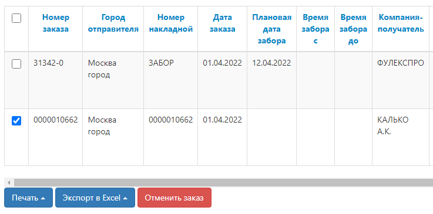

# Оформление доставок готовых грузов до маркетплейсов

Доставка готовых грузов до маркетплейсов осуществляется в два этапа:

1. Вкладка "Оформить заказ" -> "Новый заказ", инструкция [Оформление доставок готовых грузов до маркетплейсов](delivery_ready_mp.md) (текущая).
2. Вкладка "Оформить заказ" -> "Заявка на забор", инструкция [Оформление забора](registration_cargo_pickup.md)

**ВАЖНО:** 1 поставка на маркетплейс = 1 заявка в Личном кабинете FulEx

## Создание заявки
Для создания заявки необходимо перейти во вкладку Оформить заказ далее Новый заказ

## Оформление заявки

### Номер заказа

- Укажите внутренний номер заказа, если вы ведете внутренний учет в своей системе.
- В случае если учет не ведется, заполните это поле произвольно, либо пропустите.

### Тип отправления
Всегда - FulEx
 
### Город получателя
В зависимости от населенного пункта, где располагается склад нужного Вам маркетплейса

### Вид доставки
Выберите из раскрывающегося списка в поле "Вид доставки", нужный вариант ПВЗ маркетплейса:

### Данные о получателе
Необходимо указать данные о компании, в которую будет доставлен заказ.

- **Адрес и индекс получателя** заполняется автоматически после нужного ПВЗ;
- **Компания** - название маркетплейса;
- **ФИО получателя** - Укажите ФИО человека, с кем можно коммуницировать по вопросу поставки. Это должен быть сотрудник с вашей стороны. 
- **Телефон получателя** - контактный телефон (для коммуникации).
- **Дата доставки** - планируемая дата доставки
  - Обратите внимание, что заявки принятые до 18:00 могут доставляться на следующий день.
  - Если Вы оформляете заявку после 18 часов, то она будет доставлена через день.
- **Время доставки с / Время доставки по** - интервал, в который необходимо доставить заказ
  - Доступные интервалы: 9:00 - 12:00; 12:00 - 15:00; 15:00 - 18:00; 18:00 - 20:00. 
  - Минимальные интервалы доставки 3 часа - выберите наиболее подходящий интервал, исходя из временного окна маркетплейса.
  
## Данные о грузе 
### Товары (грузоместа)
Нажмите на кнопку “Добавить”.

* Добавьте информацию о грузе. 

Заполните название (например, коробка/и, паллет/ы) точный вес каждого грузоместа (ваш товар представлен грузоместами) и его габариты (ДхШхВ). Это **ВАЖНО** для того чтобы планирование доставки было с учетом объемного веса и специфики груза, если таковые будут присутствовать. 

* Нажмите кнопку сохранить после добавления грузомест.
**Пример:** если 3 коробки одинакового веса и размера, то это информация об одном грузоместе (количество будет 3), если каждая из них разных, то добавить другое - необходимо с помощью повторного нажатия на кнопку "Добавить", первое грузоместо предварительно сохранив.

### Данные о грузе (общие)

* **Вес** - автоматически суммируется, если Вы далее верно заполнили раздел "Грузоместа (объем)", поэтому не заполняйте его.
* **Сумма наложенного платежа** - 0. Мы не должны брать денежные средства с сотрудников маркетплейса :). 
* **Сумма страхования груза** из этой цифры будет рассчитана страховка вашего отправления, если Вы указали сумму и сохранили заявку, то отменить данное действие или изменить указанную сумму нельзя. Данные автоматически отправляются в страховую компанию. Если вам не нужно страховать груз, то напишите 0.
 
- **Количество грузомест** - общее количество коробок/паллет, предназначенных для доставки до маркетплейса. 

### Дополнительная информация

- **Поручение** - техническое задание, в котором описано что нужно сделать с поставкой.

### Тип оплаты

- Выберите “Тип оплаты” - Без оплаты. 

### Прикрепленные файлы

- Вложите документы, которые необходимо передать получателю (например, доверенность).

Заявка готова - ВЫ МОЛОДЕЦ!

## ОБЯЗАТЕЛЬНЫЕ УСЛОВИЯ* 
Заявка на доставку оформлена, далее необходимо сделать следующее:
1. Перейдите во вкладку «Главная» и выберите «Заказы, оформленные сегодня» 

2.	Далее выделите галочкой заказ на доставку, для которого необходимо напечатать наклейки и нажмите кнопку "Печать", выбрав удобный вариант (Наклейки Zebra (для термопринтера)/ Наклейки А4)

1. Распечатайте этикетки и наклейте их на каждое грузоместо. Количество наклеек ровняется количеству грузомест, ранее указанного в заявке. Они необходимы для того, чтобы груз могли опознать на складе, пересчитать, принять по количеству грузомест и отправить на доставку. 
2. Завершающее действие. Распечатайте Акт приема-передачи, сохраните у себя. Его необходимо вложить в заявку на забор (если хотите, чтобы курьер его привез на забор) или подписать его с курьером в момент передачи груза при заборе. Акт-приема передачи печатается в двух экземплярах.

 *Более подробное описание работы с этикетами и актом приема-передачи располагается - [тут](label_delivery.md). Ознакомьтесь! 
 
Фух...теперь все готово! 

## Статус выполнения заявки
Отслеживать статус выполнения заявки можно через вкладку "Отслеживание" по ее номеру. 