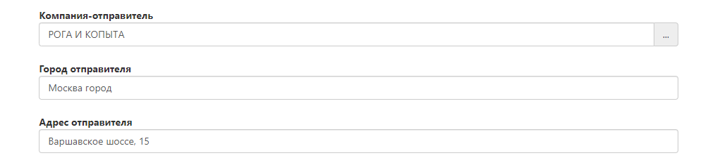

# Оформление забора с последующей приемкой
### Дата забора
В какой день необходимо забрать отправления

### Интервал забора
Укажите временной интервал,когда Ваш склад готов отгрузить заказы*. Доступные интервалы: 9:00 - 12:00; 12:00 - 15:00; 15:00 - 18:00; 18:00 - 20:00.

- *ВНИМАНИЕ. Забор предполагает, что Ваши посылки или паллеты уже готовы к загрузке в машину.Ожидание на забор не осуществляется. 
- Если вы передаете паллеты и у Вас нет возможности осуществить погрузку в машину своими силами, то в таком случае в заявке будет выставлен “холостой прогон”, так как курьер не имеет возможности погрузить паллеты в транспорт. 
- Если вы передаете посылки (коробки) и у вас нет возможности осуществить погрузку в машину своими силами, то в таком случае в заявке будет выставлены ПРР (3 руб за каждый кг забора)

### Данные об отправителе
Необходимо заполнить данные, откуда Фулекс будет осуществлять забор.

* Адрес - ВАЖНО. Необходимо указывать адрес из предлагаемых системой адресов. В ином случае Ваш адрес не попадет в наш справочник и Логисты не смогут спланировать Ваш забор. Будьте внимательнее.

* Данные об отправителе - Укажите контактные данные человека, который будет передавать готовые посылки / груз. Именно по этому номеру наш водитель и диспетчер будет связываться в процессе забора и именно туда будут поступать звонки об опозданиях (если они будут).
  

### Данные о грузе (общие) - пропустите эти поля

* Сумма - из этой цифры будет считаться страховка Вашего груза исходя из тарифов Фулекс, если Вы указали сумму и сохранили заявку, то отменить сумму груза и сумму страхования нельзя. Данные автоматически уходят в страховую компанию .
* Если Вам нужно застраховать груз, то укажите сумму.

### Поручение
Укажите дополнительную информацию о Вашем заборе.

 
### Грузоместа (объем)
В них необходимо указать точный вес каждого места и его весогабаритные характеристики, для того чтобы планирование забора было с учетом объемного веса, высоты, ширины и специфики Вашего груза/посылок, если они есть. Нажмите на кнопку “добавить”

* Добавьте развернутую информацию о грузе

* Нажмите кнопку сохранить после добавления грузомест.

### Прикрепленные файлы
Заполните и вложите приходный файл (https://docs.google.com/spreadsheets/d/121JPC3rMF0wG-0xPvcYwhlHRuutO6wXvVDiW6wD2b1k/edit#gid=0) , Он обязателен для последующей приемки товара на склад фулекс.

* Укажите в ТТН список номенклатуры, шк, артикулы и количество товара, которые необходимо принять.
