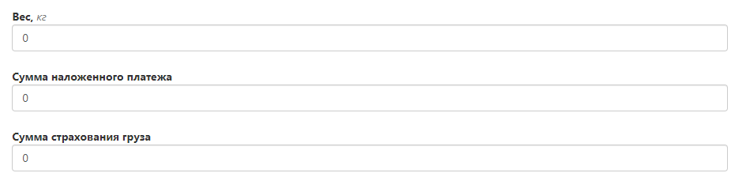
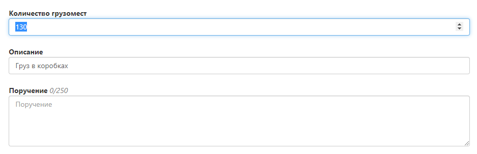
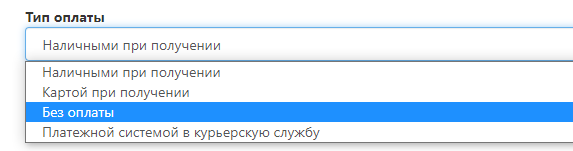

# Оформление прихода товара на склад Фулекс

Если вы работаете по договору Фуллфилмента и планируете самостоятельно привезти груз на склад Фулекс для последующей приемки и размещения на складе, вам необходимо оформить заявку в личном кабинете фулекс и вложить в нее сопроводительные документы.

## Номер заказа

- Укажите внутренний номер перемещения товаров, если вы ведете внутренний учет в своей системе.
- В случае если учет по перемещениям не ведется, заполните это поле произвольно, либо пропустите. 

## Данные об отправителе
Заполните данные об отправителе. 

- По умолчанию контактные данные автоматически заполнены из договора.
- Адрес по умолчанию - Дорожная ул, д 3 к 6  (адрес склада фулекс, тк именно с него осуществляется большинство движений товара).

## Данные о получателе

- Необходимо наполнить поля данными, по которым мы определяем, что данная заявка является приходом товара на склад Фулекс.
- Укажите в компании получателя - КОМПАНИЯФУЛЕКС  

## Развернутые данные о получателе 

- Укажите в поле “вид доставки” - ФУЛЕКС ПРИЕМКА.
- Адрес получателя - заполняется автоматически.
- ФИО - сотрудник склада.
- Телефон - контактный телефон вашей компании. По нему будет осуществляться коммуникация по вопросам приемки товара.  

## Интервалы прихода груза

- Укажите дату, когда планируете привезти груз.
- Укажите интервал, когда приедет груз. Доступные интервалы: 9:00 - 12:00; 12:00 - 15:00; 15:00 - 18:00; 18:00 - 20:00.

## Товары

- Пропустите это поле и не заполняйте его.

## Общая информация о грузе
Укажите общую информацию о грузе, который планируете привезти.

- Вес - укажите общий вес груза, на основании этих данных мы спланируем смену, если ожидается большая работа по погрузочно-разгрузочным работам.
- Сумма - пропускайте.
- Сумма страхования - пропускайте.

## Данные о грузе

- Количество грузомест - укажите количество  коробов / паллет. 
- Описание - укажите характер грузоместа (короб / паллет)
- Поручение - укажите дополнительную информацию, которая необходима на приемке товара. 

## Тип оплаты
Укажите Без оплаты

## Пропустите указанные поля ниже

## Прикрепленные файлы

- Заполните и вложите [приходный файл](https://docs.google.com/spreadsheets/d/121JPC3rMF0wG-0xPvcYwhlHRuutO6wXvVDiW6wD2b1k/edit#gid=0). Он обязателен для приемки товара на склад фулекс.
- Укажите в товарно-транспортной накладной список номенклатуры, штрихкоды, артикулы и количество товара, которые необходимо принять.
- Название, артикул, штрихкоды должны полностью совпадать с данными о номенклатуре, которую вы создали ранее в личном кабинете Фулекс. 

## Статус выполнения
- После прихода товара на склад, можете ориентироваться на статус данной заявки и отслеживать остатки. 
- По завершению приемки на свою электронную почту вы получите МХ-1. 
- Если ваш товар не приходит в указанную дату (в заявке), то заявка будет отменена нашими коллегами и вам необходимо будет сформировать еще одну заявку.
- Если ваш товар придет без заявки, то он попадет в зону неопознанного товара либо не будет принят, аналогично, если в заявке не будет документов либо номенклатуры.