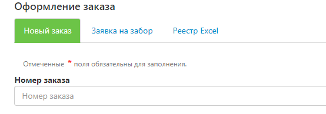
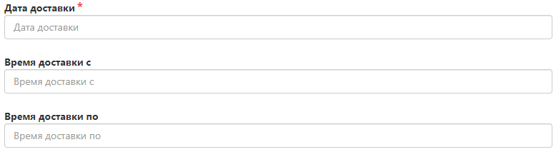

# Оформление прихода товара на склад FuLEx

Для осуществления Полной приемки и размещения товара на складе FuLEx следует заблаговременно оформить заявку о планируемом поступлении, вложить в нее соответствующие документы и убедиться, что Номенклатура на этот товар создана во вкладке «Склад», подробная инструкция по Созданию номенклатуры располагается по [ссылке](nomenclature.md).

## Создание заявки
Для создания заявки необходимо перейти во вкладку Оформить заказ далее Новый заказ

## Оформление заявки
### Номер заказа

- Укажите внутренний номер перемещения товаров, если вы ведете внутренний учет в своей системе.
- В случае если учет по перемещениям не ведется, заполните это поле произвольно, либо пропустите. 

### Тип отправления
Всегда - FulEx
 

### Город получателя
Город, где располагается Пункт приема товара FuLEx

### Вид доставки
Выберите из раскрывающегося списка в поле "Вид доставки - ПВЗ" - ФУЛЕКС ПРИЕМКА.

## Данные о получателе

- **Адрес и индекс получателя** заполняется автоматически после выбора ПВЗ ФУЛЕКС ПРИЕМКА;
- **Компания** - название компании получателя, конечно - FuLEx;
- **ФИО получателя** - не имеет значение, но заполнить надо, поэтому напишите - Сотрудник склада;
- **Телефон получателя** - не имеет значение, но заполнить надо, поэтому номер может быть произвольным.

### Дата прихода

- Укажите дату, когда планируете привезти груз.
  **ВНИМАНИЕ:**  Если ваш товар не приходит в указанную дату (в заявке), то заявка будет отменена и необходимо будет сформировать заявку повторно.  
  **ВАЖНО:** Если заявка будет отсутствовать – склад не приступит к разгрузке.
- Точный временной интервал прихода товара. Доступные интервалы: 9:00 - 12:00; 12:00 - 15:00; 15:00 - 18:00; 18:00 - 20:00.

### Товары

- Пропустите это поле и не заполняйте его.

### Общая информация о грузе
Укажите общую информацию о грузе, который планируете привезти.

- **Вес** - укажите общий вес груза, на основании этих данных мы спланируем смену; 
- **Сумма наложенного платежа** - обязательно пропустить / поставить 0. 
- **Сумма страхования груза** - обязательно пропустить / поставить 0.
- **Количество грузомест** - укажите количество  коробов / паллет. 

### Поручение
При наличии укажите важную к исполнению информацию - например:  
- Техническое задание (ТЗ) для осуществления приемки (если ТЗ обширное, то вложите его в Прикрепленные файлы и сообщите об этом в поле "Поручение");
- специфические особенности при разгрузке товаров, и т.п. 

### Тип оплаты и необходимость возврата документов 

- **Тип оплаты** - всегда "Без оплаты";
- **Необходимость возврата документов** - Нет. FuLEx не несет ответственность за передачу и сохранность ваших документов. 

### Прикрепленные файлы

- Заполните и вложите [приходный файл](https://docs.google.com/spreadsheets/d/e/2PACX-1vQcQGDyTZbOqW1uIjP6A953COyJRQUYuOA7yYIsu2Sb9K28bEUIDH07UppzLmas5zMaa3BTl34J_1Fs/pub?output=xlsx). Он обязателен для приемки товара на склад FuLEx.
- Название, артикул, штрихкоды должны полностью совпадать с данными в номенклатуре, которую вы создали ранее в личном кабинете FuLEx. 

## Статус выполнения приемки товара
- После прихода товара на склад, можете ориентироваться на статус данной заявки и отслеживать остатки во вкладке "Склад". 
- По завершению приемки подписанный Акт приема-передачи ТМЦ на ответственное хранение по форме МХ-1 будет прикреплен в оформленную заявку на приход.

FuLEx - с нами проще!