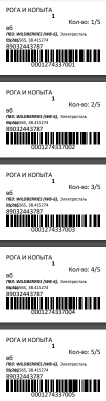
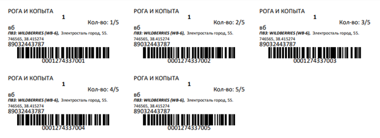
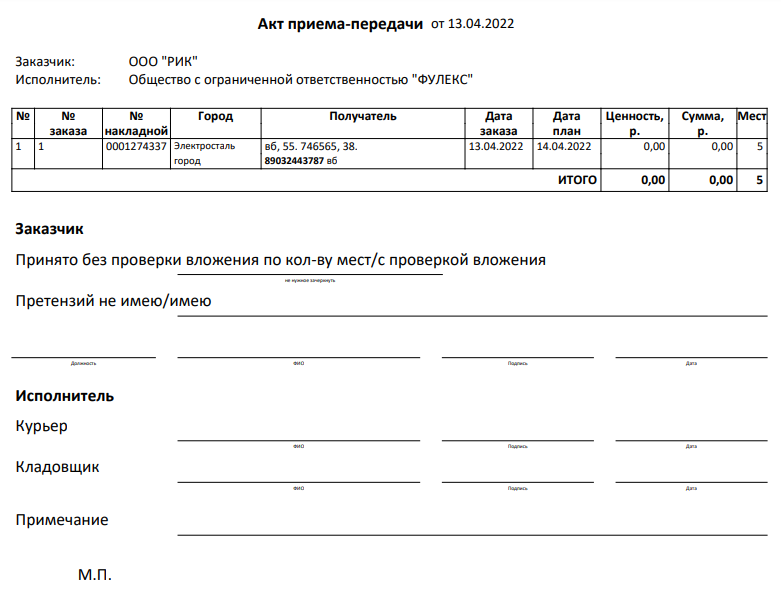

# Отгрузочные ярлыки и Акт приема-передачи

## Отгрузочные ярлыки
Отгрузочные ярлыки представляют из себя этикетку, содержащую в себе информацию о заказе: номер, штрих-код отправления, адрес доставки и так далее. Представлены в двух форматах: Наклейка Zebra и Наклейка А4:

1. Формат этикетки для термопринтера (Наклейка Zebra):

2. Формат этикетки для обычной печати (Наклейки А4):

Наличие этикеток необходимо для систематизации и контроля движения груза. Именно по ним сотрудник склада может идентифицировать количество груза, принять его и определить куда он должен уехать. 

**ВАЖНО:**
Каждому грузоместу - своя отдельная этикетка. Для этого в заявке на доставку должно быть указано корректное количество грузомест.
Этикетки не печатаются из заявок на забор, исключительно из заказов на доставку. 

## Акт приема-передачи
Акт приема-передачи необходимо распечатать и вложить в заявку на забор (если хотите, чтобы на забор курьер привез распечатанные экземпляры) или подписать его в момент передачи груза при заборе. Акт-приема передачи печатается в двух экземплярах.

После передачи груза по заявке на забор, запросите у сотрудников чата клиентской поддержки подписанный кладовщиком экземпляр, что подтвердит факт приемки груза на складе. 

Теперь можете быть спокойны. Ваш груз не потеряется! 