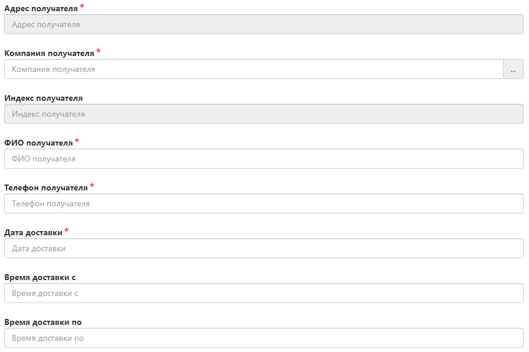
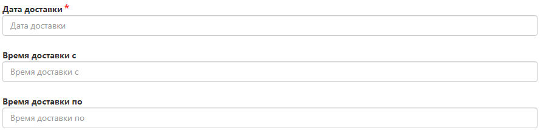

# Передвижение товара внутри склада FuLEx (иные услуги)

Фотографии товаров, перенос товаров с одной единицы номенклатуры на другую, проверка на брак, комплектация наборов, повторный пересчет, дополнительная переупаковка, сортировка, внеплановая инвентаризация и тому подобное - для всего этого необходимо пользоваться данной инструкцией. 
Такие операции необходимо производить только путем одновременного оформления 2-х заявок:
1. [Заявку на самовывоз](pickup.md)
2. [Заявку на приход товара](invoice.md)

**Причина:** движение цикла начнется со склада FuLEx и финишной точкой обработки товара будет тоже склад FuLEx.

## Создание заявок
Для создания заявок необходимо перейти во вкладку Оформить заказ далее Новый заказ. Сначала оформить заявку на самовывоз, затем оформить заявку на приход товара, указав в Поручение номер первой заявки (на самовывоз).

## 1. Оформление заявки на самовывоз, целью которой является внутреннее перемещение по складу

Особых различий между инструкцией [Оформление заявки на самовывоз](pickup.md) нет. Но вынесем основные отличия и опишем их:

 

- **Адрес и индекс получателя** заполняется автоматически после выбора нужного ПВЗ;
- **Компания получателя** - FuLEx (можно на русском ;));
- **ФИО получателя** - не имеет значение, но заполнить надо, поэтому напишите - Сотрудник склада;
- **Телефон получателя** - не имеет значение, но заполнить надо, поэтому номер может быть произвольным.
- **Дата доставки** - система автоматически предложит следующий день. Склад выполнит заявку исходя из объемов работы, указанной в ней. 
- **Время доставки с / Время доставки по** - не заполняйте.

### Данные о грузе (общие)

* **Вес** - автоматически суммируется, если ранее верно был заполнен раздел "Товары";
* **Сумма наложенного платежа** - указывайте 0. 
* **Сумма страхования груза** - указывайте 0.

 

- **Количество грузомест** - заполнится складом при необходимости. 

### Дополнительная информация (Поручение)

- **Поручение** - техническое задание, в котором описано что нужно сделать с товаром из заявки, если ТЗ обширное, то вложите его в Прикрепленные файлы и сообщите об этом в поле "Поручение". Перечень услуг склада представлен в Приложении № 1 к Агентскому договору.

Не забудьте воспользоваться остальными правилами из инструкции [Оформление заявки на самовывоз](pickup.md).

## 2. Оформление заявки на приход

Особых различий между инструкцией [Оформление прихода товара на склад FuLEx](invoice.md) нет. Но вынесем основные отличия и опишем их:

- **Дата доставки** - система автоматически предложит следующий день. Склад выполнит заявку исходя из объемов работы, указанной в ней. 
- **Время доставки с / Время доставки по** - не заполняйте.

### Данные о грузе (общие)

* **Вес** - автоматически суммируется, если ранее верно был заполнен раздел "Товары";
* **Сумма наложенного платежа** - указывайте 0. 
* **Сумма страхования груза** - указывайте 0.

 

- **Количество грузомест** - заполнится складом при необходимости. 

### Дополнительная информация (Поручение)

- **Поручение**:
1. Укажите номер первой заявки, оформленной на самовывоз, которая предполагает сборку товара. 
2. Пропишите техническое задание, в котором описано что нужно сделать с товаром из заявки, если ТЗ обширное, то вложите его в Прикрепленные файлы и сообщите об этом в поле "Поручение". Перечень услуг склада представлен в Приложении № 1 к Агентскому договору.

Итак, вы молодец, оформили целых 2 заявки. Если все сделали правильно, а мы в вас не сомневаемся, то теперь остается отслеживать их выполнение. 

## Статус выполнения заявок

- Заявки увидит склад, в соответствии с нашим регламентам мы ее соберем и выполним действия, указанные в поручении/ТЗ. Сроки исполнения по каждому циклу указаны в договоре в Приложении № 1. 
- **ВНИМАНИЕ**, в заявках будут выставлены услуги на основании вашего технического задания. Услуга применяемая по умолчанию: комплектация.
- Отслеживать статус выполнения заявок можно через вкладку "Отслеживание" по ее номеру. 