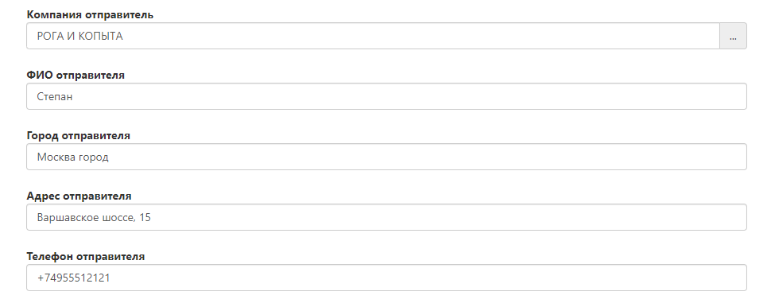
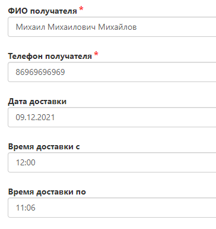
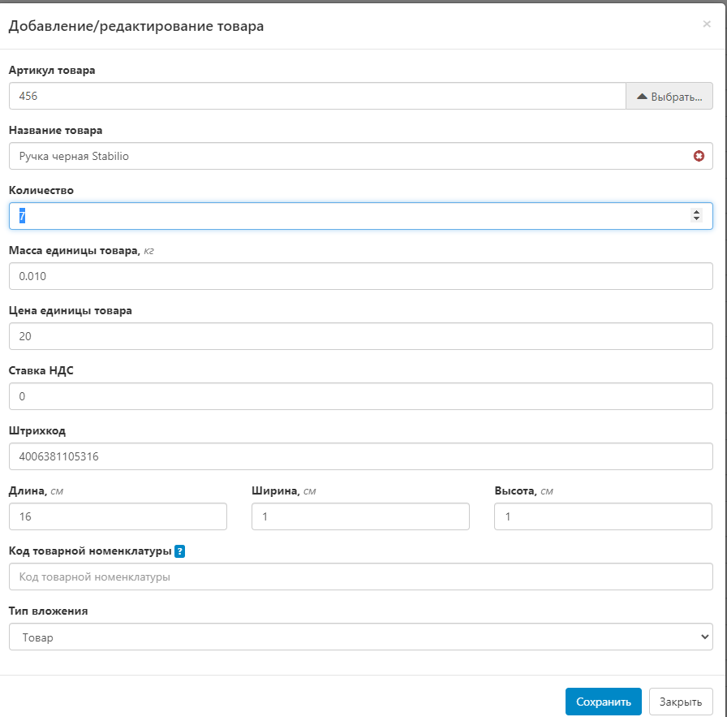
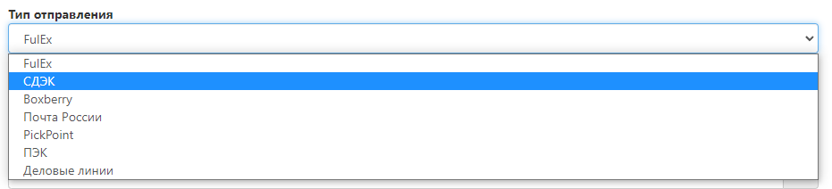

# Передвижение товара внутри склада FulEx

Для того чтобы оформить движение товара внутри склада Fulex, необходимо оформить заявку на самовывоз, указав в поручении что именно нужно сделать с вашим товаром. (фотографии, проверка на брак, комплектация наборов, повторный пересчет или внеплановый инвент). Такие операции необходимо фоформлять через “заявку на самовывоз” и заявку на приход товара, тк движение цикла начнется с нашего склада и финишной точкой обработки товара будет склад Fulex. 

## Номер заказа

- Укажите внутренний номер заказа, если вы ведете внутренний учет в своей системе.
- В случае если учет не ведется, заполните это поле произвольно, либо пропустите.

## Данные об отправителе

- По умолчанию контактные данные автоматически заполнены из договора.
- Адрес по умолчанию - Дорожная ул, д 3 к 6  (Обратите внимание, что данные в этих полях должны отвечать на вопрос “Откуда мы берем товар и куда мы его отправляем”).

## Адрес получателя
- Компания получателя - вы можете указать компанию Fulex или свою компанию.
   
    
- Выберите в поле “вид доставки” - Фулекс;; Дорожная, д. 3 к. 6. 
  - Если вы Укажете “курьерскую доставку по адресу, то ее запланируют логисты в маршрут или могут отменить, как ошибочно созданную” будьте внимательны.  
    
    
- Адрес Получателя - заполняется автоматически.

## Заполните данные о получателе

- ФИО - укажите "Сотрудник склада". 
- Телефон - укажите номер вашей компании (по нему будут звонить, если у коллег со склада возникнут вопросы по обработке вашего товара).
- Дата доставки - укажите дату следующего дня
  - Обратите внимание, что заявки после 18:00 нельзя оформить на следующий день.
- Время доставки с / Время доставки по - не заполнять.

## Товары

Необходимо открыть развернутое меню и добавить товар, который  необходимо добавить в заказ.

- Нажмите на кнопку “выбрать“ и в выпадающем меню вы увидите всю номенклатуру, которая была ранее создана, в том числе позиции с остатком 0 (добавить в заявку их нельзя, они отображаются информативно)
  
  
- Добавьте товарную единицу в заявку, указав нужное количество.
  
  
- Нажмите кнопку сохранить, таким образом Вы добавили SKU, 
  
  
- После того как в заявке вы увидите добавленную позицию можно выполнить те же действия, для добавления новых позиций.

## Дополнительная информация

- Описание - краткое описание, что нужно сделать с Вашим товаром 
- Поручение - детальное техническое задание, в котором описано что нужно сделать с вашим товаром 

## Тип оплаты

- Необходимо указать “без оплаты”. 
- При других типах оплаты заявка будет идти с наложенном платежом (для движения товара внутри склада это невозможно)

## Данные об отправлении
- Тип доставки - выберите FulEx.
    
    

## Прикрепленные файлы

- Прикрепленные файлы - вы можете вложить техническое задание о проверке на брак, если количества символов в поле поручение не хватает для описания “что нужно сделать с Вашим товаром” 
- Вы можете описать критерии брака в файле и вложить его в данное поле
- Вы можете отправить образец фотографии , которые необходимо сделать 
- Вы можете вложить файл-форму инвентаризации, если вы инициируете движение товара для инвентаризации. 

## Ожидание статуса

- После создания вашу заявку увидит склад и в соответствии с нашими регламентами мы ее соберем и выполним действия указанные в поручении. 
- Обратите внимание, что в заявке на движение товара внутри склада Fulex будут выставлены услуги в соответсвии с вашим техническим заданием.
- Обратите внимание, что ваш товар фактически находится на складе Fulex, но по складской системе его списали с остатков. Поэтому рекомендуем сразу после оформлении заявки на движение товара сразу сделать заявку на приход товара, вложив сопроводительные документы.