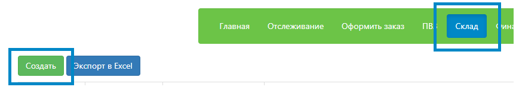
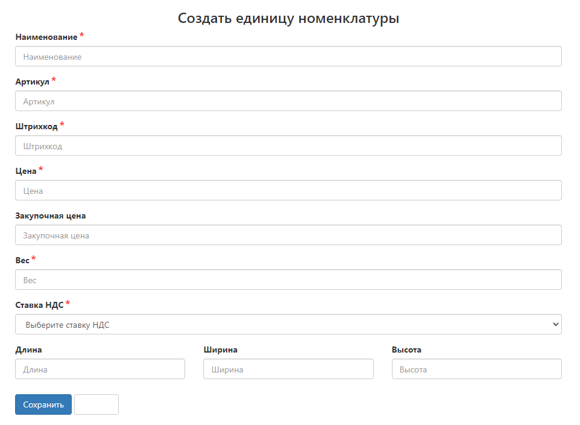
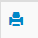
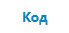
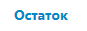
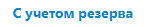
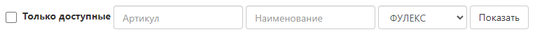
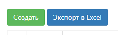
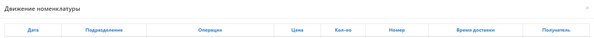

# Создание номенклатуры 
**Номенклатура** - наименование, характеристики и свойства товара, другими словами - карточка товара.

## Вручную
В личном кабинете откройте вкладку “**Склад**”. Чтобы вручную завести одну единицу номенклатуры, нажмите на кнопку “**Создать**”.

  

Откроется окно с созданием единицы номенклатуры

  

Поля для заполнения (обязательные поля отмечены - *):
   - **Наименование** - указывается то, что фактически указано на товаре, если это не на русском языке, то в скобках указать перевод. Наименование не должно совпадать с ранее внесенными в личный кабинет.
   - **Артикул** - указывается то, что фактически указано на товаре, если на товаре отсутствует, необходимо сгенерировать уникальный. Артикул не должен совпадать с ранее внесенными в личный кабинет.
   - **Штрихкод** - указывается то, что фактически указано на товаре, если на товаре отсутствует, необходимо сгенерировать уникальный. Штрихкод не должен совпадать с ранее внесенными в личный кабинет.
   - **Цена** - стоимость товара в розничной продаже, если вы пользуетесь наложенным платежом при доставке курьерской службой. В случае неиспользования, необходимо указать 0.
   - **Закупочная цена** - стоимость товара, по которой была осуществлена покупка товара у поставщика. На основе данной стоимости покрывается страховой случай. Данная стоимость подтверждается закупочными ведомостями.
   - **Ставка НДС** - процент ставки НДС. Поле не может быть пустым. Если товар не облагается НДС, поставьте значение 0.
После заполнения обязательных полей нажмите кнопку "**Сохранить**”

## Через импорт Excel
Скачайте [шаблон для создания номенклатуры](https://drive.google.com/uc?export=download&id=1H5BxPUPUX9q0e2s0thtoov-3cyDSMcje). 
Столбцы, выделенные красным, являются обязательными для заполнения.
После формирования списка номенклатуры, направьте этот файл в чат клиентской поддержки с пометкой "Создание номенклатуры".

## Отображение номенклатуры в личном кабинете
Наименование столбцов, которые позволяют, легко пользоваться своим складом:
 -  - печать штрихкода карточки товара
 -  - порядковый номер карточки товара
- **Артикул, штрихкод, наименование, примечание, ДхШхВ, Вес** - соответствует условиям, которые были заполнены при создании.  (ДхШхВ и Вес товара сотрудники склада перепроверят при приемке)
 -  - актуальное количество товара на складе без движения.
-  количество товаров, входящих во вложения корреспонденции, отвечающей одновременно следующим условиям:
   - не была скомплектована;
   - не была доставлена;

Если вы хотите получить карточки товара по определенным условиям, вы можете воспользоваться фильтром номенклатуры в правой части экрана

Вы можете воспользоваться экспортом номенклатуры в Excel, для этого нажмите кнопку “**Экспорт в Excel**” в правой части экрана

## Движение номенклатуры

Посмотреть движение номенклатуры можно, нажав на карточку товара (номенклатуру). 

Информация по полям:
  - **Дата** - дата совершения операции;
  - **Подразделение** - подразделение, которое взаимодействовали с операцией;
  - **Операция** - какая операция производилась с товаром
  - **Цена** - стоимость наложенного платежа;
  - **Количество** - количество единиц, которое было задействовано в операции;
  - **Номер** - номер отправления;
  - **Время доставки** - дата доставки или завершения операции;
  - **Получатель** - кто является получателем операции.

Для более детального просмотра совершенной операции по позиции, нажмите на нее.

Успехов!

