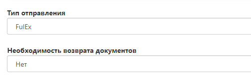

# Оформление заявки на самовывоз

## Номер заказа

- Укажите внутренний номер заказа, если вы ведете внутренний учет в своей системе.
- В случае если учет не ведется, заполните это поле произвольно, либо пропустите.

## Данные об отправителе
Заполните данные об отправителе. 

- По умолчанию контактные данные автоматически заполнены из договора.
- Адрес по умолчанию - Дорожная ул, д 3 к 6  (адрес склада фулекс, так как именно с него осуществляется большинство движений товара).

## Данные о получателе

- Необходимо указать данные о компании, которой отгружается ваш заказ.
- Выберите в “вид доставки” - Фулекс;; Дорожная, д. 3 к. 6.
    
- Адрес Получателя - заполняется автоматически.
- ФИО - Укажите ФИО человека, который заберет самовывоз. 
- Телефон - контактный телефон получателя (по нему будет осуществляться коммуникация по самовывозу).

## Дата выдачи самовывоза 

- Укажите дату, когда получатель планирует получить заказ.
- Укажите интервал, в который получатель заберет заказ. Доступные интервалы: 9:00 - 12:00; 12:00 - 15:00; 15:00 - 18:00; 18:00 - 20:00.

## Товары

Необходимо открыть развернутое меню и добавить товар, который  необходимо добавить в заказ.

- Нажмите на кнопку “выбрать“ и в выпадающем меню вы увидите всю номенклатуру, которая была ранее создана, в том числе позиции с остатком 0 (добавить в заявку их нельзя, они отображаются информативно)
  
- Добавьте товарную единицу в заявку, указав нужное количество.
  
- Нажмите кнопку сохранить, таким образом Вы добавили SKU, 
  
- После того как в заявке вы увидите добавленную позицию можно выполнить те же действия, для добавления новых позиций.

## Дополнительная информация

- Описание - краткое описание, что нужно сделать с Вашим товаром 
- Поручение - детальное техническое задание, в котором описано что нужно сделать с вашим товаром 

## Тип оплаты
Каким образом компания фулекс примет оплату с вашего получателя. 

- Укажите “тип оплаты” заказа вашим получателем. 
- Если заказ предоплаченный - укажите “без оплаты” 

## Данные об отправлении

- Тип доставки - FulEx 
- Необходимость возврата документов - укажите “да”, если Вам нужно вернуть оригиналы документов. `про какие документы речь?` 

## Прикрепленные файлы

- Вложите документы, которые необходимо передать получателю (доверенность, универсальный передаточный документ, товарно-транспортную накладную и тд).