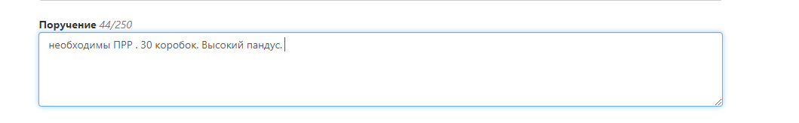

# Оформление забора
Необходимо в случае работы только по доставке готовых посылок и вам нужно передать отправления на склад Fulex, для консолидации и последующей доставки до конечного получателя.
## Дата забора
В какой день необходимо забрать отправления.

## Интервал забора
Укажите временной интервал,когда Ваш склад готов отгрузить заказы*. Доступные интервалы: 9:00 - 12:00; 12:00 - 15:00; 15:00 - 18:00; 18:00 - 20:00.

- *ВНИМАНИЕ. Забор предполагает, что ваш груз уже готов к загрузке в машину.Ожидание на забор не осуществляется. 
- Если вы передаете паллеты и у вас нет возможности осуществить погрузку в машину своими силами, то в таком случае в заявке будет выставлен “холостой прогон”, так как курьер не имеет возможности погрузить паллеты в транспорт. 
- Если вы передаете коробки и у вас нет возможности осуществить погрузку в машину своими силами, то в таком случае в заявке будет выставлены ПРР (3 руб за каждый кг забора).
- ВАЖНО Минимальные интервалы доставки 3 часа!

## Данные об отправителе
Необходимо заполнить данные, откуда курьер Fulex будет осуществлять забор.

* Адрес - ВАЖНО. Необходимо указывать адрес из предлагаемых системой адресов. В ином случае ваш адрес не попадет в наш справочник и Логисты не смогут спланировать Ваш забор. Будьте внимательнее.

* Данные об отправителе - Укажите данные контактного лица, который будет передавать груз нашему курьеру. Именно по этому номеру наш курьер и диспетчер будет связываться в процессе забора и именно туда будут поступать звонки об опозданиях (если они будут).

  

## Данные о грузе (общие) - пропустите эти поля

* Сумма - из этой цифры будет считаться страховка вашего груза исходя из тарифов Fulex, если вы указали сумму и сохранили заявку, то отменить данное действие и указанную сумму нельзя. Данные автоматически уходят в страховую компанию.
* Если вам не нужно страховать груз, то напишите 0.

## Поручение
Укажите дополнительную информацию о вашем заборе.

 
## Грузоместа (объем)
В них необходимо указать точный вес каждого грузоместа и его весогабаритные характеристики, для того чтобы планирование забора было с учетом объемного веса, высоты, ширины и специфики вашего груза, если они есть. Нажмите на кнопку “добавить”

* Добавьте развернутую информацию о грузе.

* Нажмите кнопку сохранить после добавления грузомест.

## Прикрепленные файлы
Прикрепите Акт передачи посылок, который можно выгрузить из личного кабинета Fulex в разделе “отслеживание”, добавьте дополнительные документы, если стандартного акта приема передачи по форме Fulex недостаточно.

