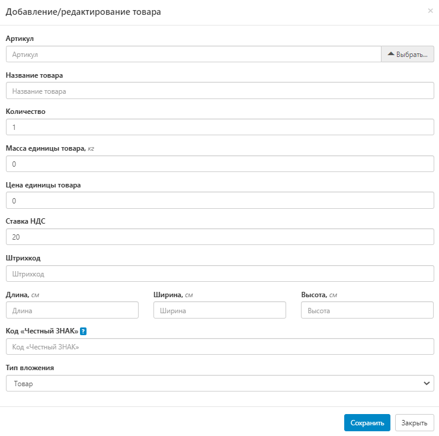
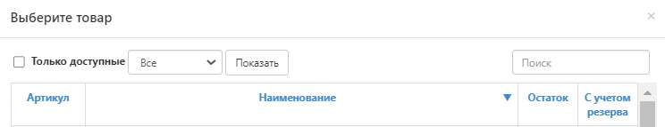
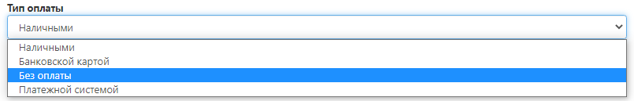

# Оформление доставки через транспортную компанию

Если получателем вашего товара является компания или физ.лицо и ему необходима доставить заказ, то воспользуйтесь именно этой инструкцией. Успехов!

## Создание заявки
Для создания заявки необходимо перейти во вкладку Оформить заказ далее Новый заказ

## Оформление заявки
### Номер заявки

- Укажите внутренний номер заказа, если вы ведете внутренний учет в своей системе.
- В случае если учет не ведется, заполните это поле произвольно, либо пропустите.

### Тип отправления
Выберите Транспортную компанию на свой вкус, кроме **FuLEX**:

### Способы доставки (информация)
Выбранная вами транспортная компания может осуществить:
- доставку до адреса конечного получателя;
- доставку до ПВЗ, уже из которого получатель заберет заказ.
- 
### Город получателя и вид доставки

В поле **"Город получателя"** укажите город/населенный пункт.
**ВАЖНО!** Начните вводить название города/населенного пункта, но выбор совершите из выпадающего списка. 
1. Если требуется доставка до конечно получателя по адресу, то в поле  **"Вид доставки"** выберите "Курьерская доставка - по адресу".

2. Если получатель заберет заказ из ПВЗ, то выберите в поле **"Вид доставки"** нужный. 

### Адрес получателя

**1. Курьерская доставка - по адресу:**
 

- **Адрес получателя**  - заполните корректный адрес: улица, дом, квартира. **ВАЖНО!** Начните вводить название улицы, но выбор совершите из выпадающего списка. 
- **Индекс получателя**  - заполнится автоматически после заполнения поля "Адрес получателя".

**2. Вид доставки - ПВЗ:**

 
- **Адрес и Индекс получателя**  -заполнится автоматически после выбора ПВЗ в поле "Вид доставки".

### Данные о получателе
 

- **Компания** - название компании получателя, если заказ заберет частное лицо, напишите просто ЧАСТНОЕ ЛИЦО;
- **ФИО получателя** - ФИО человека, кто будет забирать заказ. Если заказ забирает частное лицо - получение по паспорту, если представитель компании (например, курьер), то при себе ему необходимо иметь оригинал доверенности на указанное лицо. 
- **Телефон получателя** - контактный телефон (при необходимости).
- Необходимо указать данные о компании, которой будет доставлен ваш заказ.
- **Дата и время доставки** - когда необходима доставка получателю (может отличаться от факта, так как доставляют транспортные компании, при изменении они согласуют с получателем удобную дату).  

### Товары

Необходимо открыть развернутое меню и добавить товар в заказ.

- **Артикул товара** - нажмите “Выбрать“. Открывается список вашей номенклатуры, возможность поиска нужного SKU и иные варианты сортировки. 

 

Выберите нужный артикул товара.

**ВАЖНО:**  позиции с остатком 0 добавить в заказ нельзя. 

- **Количество** - впишите количество единиц выбранного артикула;

Оставшиеся поля заполнятся автоматически, либо правятся вручную, кроме ВГХ (весогабаритных характеристик). 
Особое внимание уделите полям, где требуется указание цены. Если при получении заказ не будет предполагать оплату, лучше написать "0". 

Теперь смело нажимайте **"Сохранить".**

**Посмотрите**, в заявке отображается нужное количество единиц выбранной позиции. Теперь  выполните те же действия, только для добавления новых позиций.

### Данные о грузе (общие)

* **Вес** - автоматически суммируется, если ранее верно был заполнен раздел "Товары";
* **Сумма наложенного платежа** - если заказ предполагает оплату получателем.
* **Сумма страхования груза** из этой цифры будет рассчитана страховка вашего отправления, если Вы указали сумму и сохранили заявку, то отменить данное действие или изменить указанную сумму нельзя. Данные автоматически отправляются в страховую компанию. Если вам не нужно страховать груз, то напишите 0.

 

- **Количество грузомест** - заполнится складом по результатам сборки заказа.

## Дополнительная информация по заявке

- **Поручение** - техническое задание, в котором описано что нужно сделать с товаром из заявки, если такие услуги необходимы. Перечень услуг склада представлен в Приложении № 1 к Агентскому договору.
**ВНИМАНИЕ ВАЖНО:** Помимо технического задания поле "Поручение" может содержать информацию о конечном плательщике стоимости доставки. Плательщиком стоимости доставки может являться конечный получатель или вы, как Заказчик, данной услуги. Ознакомьтесь с таблицей ниже и при выборе транспортной компании, вы заранее можете выбрать, кто будет оплачивать стоимость доставки. При желании сменить плательщика - укажите в поле "Поручение" за чей счет. 
 

_Например:_ Если вам требуется доставка транспортной компанией ПЭК и оплачивать стоимость доставки будете вы, то в поле "Поручение" напишите следующее: **_Доставка за мой счет_**. 

### Тип оплаты
Выберите "Тип оплаты"

- если необходимо с получателя взять оплату за товар и его стоимость отражена в поле "Сумма наложенного платежа", то выберите удобный для него способ оплаты: Наличными / Банковской картой.
- если заказ не предполагает оплату, выберите: Без оплаты.

### Необходимость возврата документов
При необходимости: "Да"/"Нет"

### Прикрепленные файлы

- Вложите документы, которые необходимо передать получателю, или более развернутое ТЗ.
- 
## Статус выполнения заявки
Отслеживать статус сборки заказа и его доставку до Транспортной компании можно через вкладку "Отслеживание" в Личном кабинете FuLEx. После передачи заказа в Транспортную компанию, ему присвоится иной номер отслеживания. Его можно взять из Личного кабинета FuLEx в информации по заказу - графа "Трек-номер" и далее на официальном сайте Транспортной компании следить за движением посылки. 

Благодарим за пользование инструкцией, с уважением, команда FuLEx! 