# Оформление заявки на самовывоз

1. Используется для получение заказа вашими клиентами/партнерами в Пункте выдачи заказов (ПВЗ) FuLEx;
2. Для внутреннего перемещения по складу - [подробности тут](../movement.md).

## Создание заявки
Для создания заявки необходимо перейти во вкладку Оформить заказ далее Новый заказ
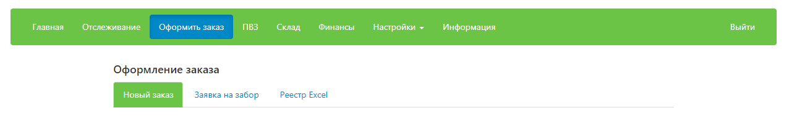

## Оформление заявки

### Номер заказа

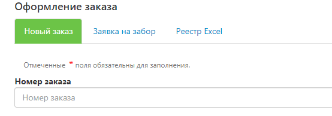
- Укажите внутренний номер заказа, если вы ведете внутренний учет в своей системе.
- В случае если учет не ведется, заполните это поле произвольно, либо пропустите.

### Тип отправления
Всегда - FulEx
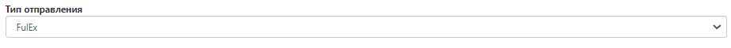 
### Город получателя
Город, где располагается Пункт выдачи заказов (самовывоза) FuLEx
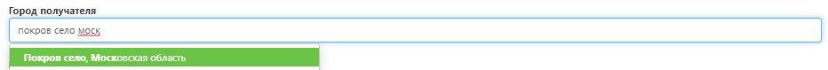
### Вид доставки
Выберите из раскрывающегося списка в поле "Вид доставки", а именно ФУЛЕКС САМОВЫВОЗ.
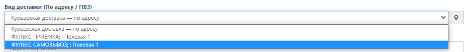
### Данные о получателе

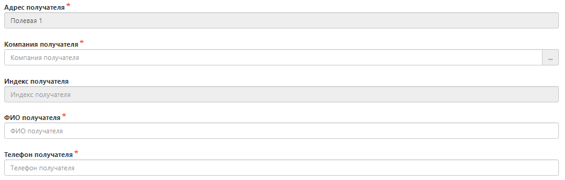

- **Адрес и индекс получателя** заполняется автоматически после выбора ПВЗ;
- **Компания** - название компании получателя, если заказ заберет частное лицо, напишите просто ЧАСТНОЕ ЛИЦО;
- **ФИО получателя** - ФИО человека, кто будет забирать заказ. Если заказ забирает частное лицо - получение по паспорту, если представитель компании (например, курьер), то при себе ему необходимо иметь оригинал доверенности на указанное лицо. 
- **Телефон получателя** - контактный телефон (при необходимости).

**ВАЖНО:** срок хранения готового заказа в Пункте выдачи FuLEx - 14 календарных дней с планируемой даты доставки. По истечение данного срок заказ автоматически будет расформирован. 

### Дата выдачи заказа на самовывоз

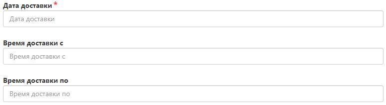
- Дата, когда получатель планирует забрать заказ.
- Удобный временной интервал для получения заказа. Доступные интервалы: 9:00 - 12:00; 12:00 - 15:00; 15:00 - 18:00; 18:00 - 20:00.

### Товары

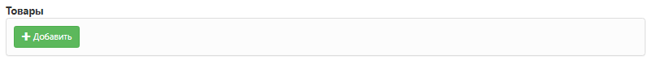

Необходимо открыть развернутое меню и добавить товар в заказ.

- **Артикул товара** - нажмите “Выбрать“. Открывается список вашей номенклатуры, возможность поиска нужного SKU и иные варианты сортировки. 

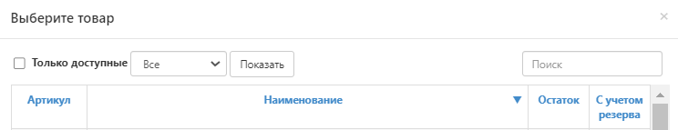 

Выберите нужный артикул товара.

**ВАЖНО:**  позиции с остатком 0 добавить в заказ нельзя. 

- **Количество** - впишите количество единиц выбранного артикула;

Оставшиеся поля заполнятся автоматически, либо правятся вручную, кроме ВГХ (весогабаритных характеристик). 
Особое внимание уделите полям, где требуется указание цены. Если при получении заказ не будет предполагать оплату, лучше написать "0". 

Теперь смело нажимайте **"Сохранить".**

**Посмотрите**, в заявке отображается нужное количество единиц выбранной позиции. Теперь  выполните те же действия, только для добавления новых позиций.

### Данные о грузе (общие)

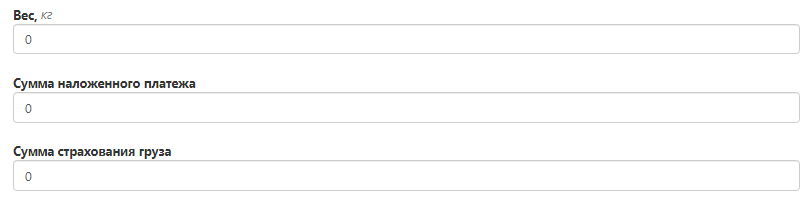

* **Вес** - автоматически суммируется, если ранее верно был заполнен раздел "Товары";
* **Сумма наложенного платежа** - если заказ предполагает оплату получателем.
* **Сумма страхования груза** из этой цифры будет рассчитана страховка вашего отправления, если Вы указали сумму и сохранили заявку, то отменить данное действие или изменить указанную сумму нельзя. Данные автоматически отправляются в страховую компанию. Если вам не нужно страховать груз, то напишите 0.

 

- **Количество грузомест** - заполнится складом по результатам сборки заказа.

### Дополнительная информация

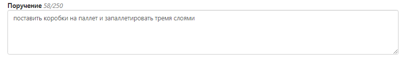
- **Поручение** - техническое задание, в котором описано что нужно сделать с товаром из заявки, если такие услуги необходимы. Перечень услуг склада представлен в Приложении № 1 к Агентскому договору.

### Тип оплаты

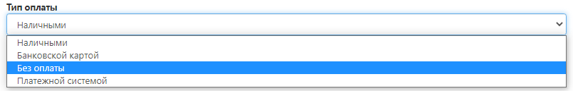
- Выберите “Тип оплаты” - Без оплаты. 

### Необходимость возврата документов
При необходимости: "Да"/"Нет"
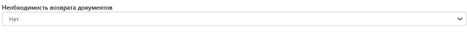

### Прикрепленные файлы

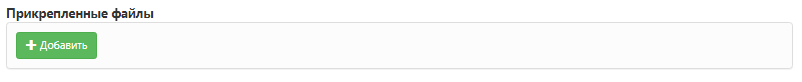
- Вложите документы, которые необходимо передать получателю, или более развернутое ТЗ.

## Статус выполнения заявки
Отслеживать статус выполнения заявки можно через вкладку "Отслеживание" по ее номеру. 

Вот и все, легко же?! 
Вперед!
