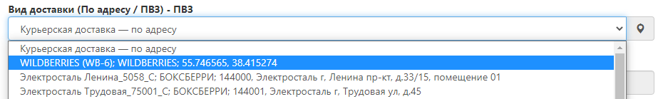
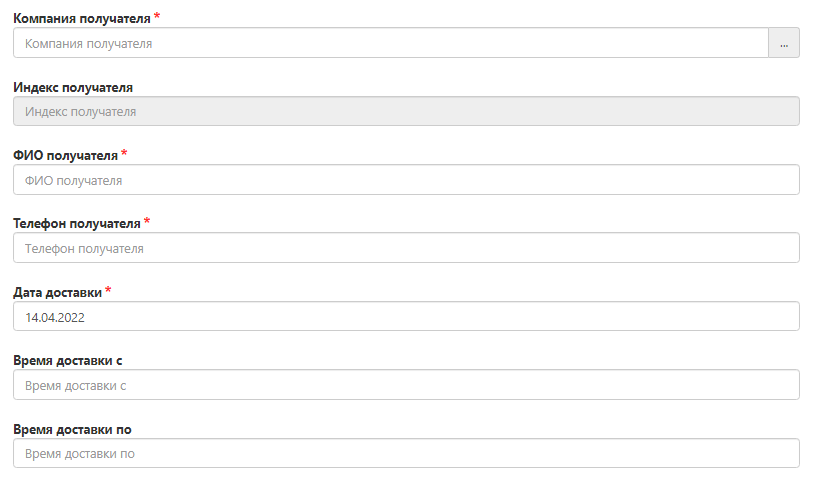
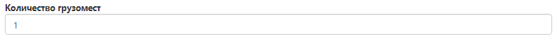

# Оформление доставки до маркетплейсов (FBO)

Схема Fulfillment by operator (FBO) - продажи со склада маркетплейса. Доставка до склада маркетплейса осуществляется после предварительной обработки и подготовки товаров на складе FuLEx. 

## Создание заявки
Для создания заявки необходимо перейти во вкладку Оформить заказ далее Новый заказ

## Оформление заявки

**Важно помнить при оформлении заявки:** 1 поставка на маркетплейс = 1 заявка в Личном кабинете FuLEx

### Номер заказа

Номер заказа должен начинаться с аббревиатуры **FBO**, далее можно указать названия маркетплейса или номер поставки из личного кабинета маркетплейса.

### Тип отправления
Всегда - FuLEx
 
### Город получателя
В зависимости от населенного пункта, где располагается склад нужного вам маркетплейса

### Вид доставки
Выберите из раскрывающегося списка в поле "Вид доставки", нужный вариант ПВЗ (склада) маркетплейса:

### Данные о получателе
Необходимо указать данные о компании, в которую будет доставлен заказ.

- **Адрес и индекс получателя** заполняется автоматически после выбора нужного ПВЗ;
- **Компания** - название маркетплейса;
- **ФИО получателя** - Укажите ФИО человека, с кем можно коммуницировать по вопросу поставки. Это должен быть сотрудник с вашей стороны. 
- **Телефон получателя** - контактный телефон человека, с кем можно коммуницировать по вопросу поставки. Это должен быть сотрудник с вашей стороны. 
- **Дата доставки** - планируемая дата доставки
  - Обратите внимание, что заявки принятые до 18:00 могут доставляться на следующий день. Не забудьте заложить время на комплектацию и упаковку товара. 
  - Если вы оформляете заявку после 18 часов, то она будет доставлена через день (в зависимости от количества и общего веса товаров).
- **Время доставки с / Время доставки по** - интервал, в который необходимо доставить заказ
  - Доступные интервалы: WB - доставка с 09:00 до 20:00 (в календарные сутки маркетплейса); иные маркетплейса - интервал временного окна Маркетплейса.
  - Минимальные интервалы доставки 3 часа - выберите наиболее подходящий интервал, исходя из временного окна маркетплейса.

### Товары

Необходимо открыть развернутое меню и добавить товар в заказ.

- **Артикул товара** - нажмите “Выбрать“. Открывается список вашей номенклатуры, возможность поиска нужного SKU и иные варианты сортировки. 

 

Выберите нужный артикул товара.

**ВАЖНО:**  позиции с остатком 0 добавить в заказ нельзя. 

- **Количество** - впишите количество единиц выбранного артикула;

Оставшиеся поля заполнятся автоматически, либо правятся вручную, кроме ВГХ (весогабаритных характеристик). 
Особое внимание уделите полям, где требуется указание цены. Заказ на маркетплейс не предполагает оплату, поэтому поставьте везде 0.

Теперь смело нажимайте **"Сохранить".**

**Проверьте**, в заявке отображается нужное количество единиц выбранной позиции. Теперь  выполните те же действия, только для добавления новых позиций.

### Данные о грузе (общие)

* **Вес** - автоматически суммируется, если ранее верно был заполнен раздел "Товары";
* **Сумма наложенного платежа** - заказ на маркетплейс НЕ предполагает оплату, поставьте 0.
* **Сумма страхования груза** из этой цифры будет рассчитана страховка вашего отправления, если вы указали сумму и сохранили заявку, то отменить данное действие или изменить указанную сумму нельзя. Данные автоматически отправляются в страховую компанию. Если вам не нужно страховать груз, то напишите 0.

 

- **Количество грузомест** - заполнится складом по результатам сборки заказа. Самостоятельно не заполняйте.

## Поручение

- **Поручение** - техническое задание, в котором описано что нужно сделать с товаром из заявки, если такие услуги необходимы (если ТЗ обширное, то вложите его в Прикрепленные файлы и сообщите об этом в поле "Поручение"). Перечень услуг склада представлен в Приложении № 1 к Агентскому договору.

### Тип оплаты и необходимость возврата документов 

- **Тип оплаты** - всегда "Без оплаты";
- **Необходимость возврата документов** - Да/Нет. 

### Прикрепленные файлы

- Вложите документы, как правило, развернутое Техническое задание. 

## Статус выполнения заявки
- Отслеживать статус выполнения заявки можно через вкладку "Отслеживание" по ее номеру. 
- Раскладка и кол-во паллетомест предоставляется вам на электронный адрес с 16:00 до 18:00 часов  накануне дня доставки. Итоговое количество паллетомест фиксируется складом после комплектации и упаковки заказа по вашему Техническому заданию (ТЗ).
- Данные по водителю и автомобилю с 18:00 до 20:00 часов накануне дня доставки на электронный адрес вашей компании.
